# System Design — Project Tracker

> Dokumen ini digenerate dari kode sumber. Gunakan sebagai referensi onboarding, integrasi, dan pengembangan fitur baru.

---

## Daftar Isi

1. [Ringkasan Sistem](#1-ringkasan-sistem)
2. [Arsitektur Sistem](#2-arsitektur-sistem)
3. [Tech Stack](#3-tech-stack)
4. [Entity Relationship Diagram (ERD)](#4-entity-relationship-diagram-erd)
   - [Domain Auth & RBAC](#41-domain-auth--rbac)
   - [Domain Project Core](#42-domain-project-core)
   - [Domain Finance](#43-domain-finance)
   - [Domain Sales & Presales](#44-domain-sales--presales)
   - [Domain System](#45-domain-system)
5. [Skema Database Lengkap](#5-skema-database-lengkap)
6. [Alur Bisnis](#6-alur-bisnis)
   - [Sales Pipeline (Sales Pitch)](#61-sales-pipeline-sales-pitch)
   - [Presales Pipeline → Convert ke Project](#62-presales-pipeline--convert-ke-project)
   - [Project Lifecycle](#63-project-lifecycle)
   - [Finance Monitoring](#64-finance-monitoring)
   - [Team Load](#65-team-load)
7. [Modul & Fitur](#7-modul--fitur)
8. [Sistem RBAC (Hak Akses)](#8-sistem-rbac-hak-akses)
9. [API Reference](#9-api-reference)
10. [Email Notifications & Scheduled Jobs](#10-email-notifications--scheduled-jobs)

---

## 1. Ringkasan Sistem

**Project Tracker** adalah aplikasi manajemen internal untuk software house / tim IT yang mengcover siklus penuh dari:

```
Prospek → Sales Pitch → Presales → Project Execution → Finance Monitoring → Laporan
```

**Pengguna utama:**
- **Admin / Project Manager** — akses penuh ke semua modul
- **Developer / QA / Designer** (Board Member) — akses ke project board, log manhour
- **Freelance** — akses terbatas: lihat board & update status task saja

---

## 2. Arsitektur Sistem

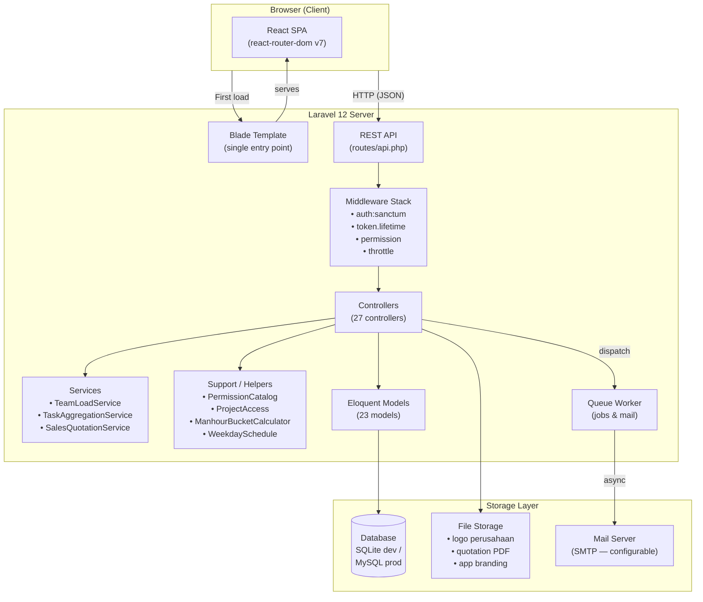

**Pola komunikasi:**
- Frontend React memanggil semua data via `/api/*` menggunakan Axios
- Autentikasi menggunakan **Laravel Sanctum** (Bearer token, expiry configurable, default 720 menit)
- Semua route API dilindungi `auth:sanctum` + `permission:{slug}` middleware
- PDF quotation di-generate server-side via **dompdf** dan disimpan di storage

---

## 3. Tech Stack

| Layer | Teknologi | Versi |
|---|---|---|
| Backend Framework | Laravel | 12.x |
| Language (BE) | PHP | 8.2+ |
| Frontend Framework | React | 19.x |
| Build Tool | Vite | 7.x |
| Router (FE) | React Router DOM | 7.x |
| UI Components | shadcn/ui + Radix UI | latest |
| Styling | TailwindCSS | 4.x |
| Drag & Drop | @dnd-kit | 6.x / 10.x |
| PDF Generation | barryvdh/laravel-dompdf | 3.x |
| Auth | Laravel Sanctum | 4.x |
| Database (dev) | SQLite | — |
| Database (prod) | MySQL / PostgreSQL | — |
| Queue | Laravel Queue (database driver) | — |
| Package Manager (FE) | npm | — |

---

## 4. Entity Relationship Diagram (ERD)

### 4.1 Domain Auth & RBAC

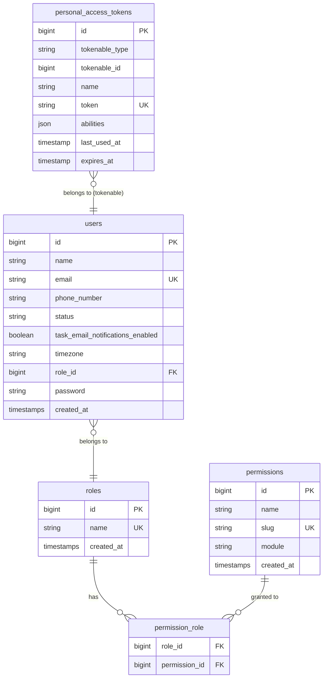

### 4.2 Domain Project Core

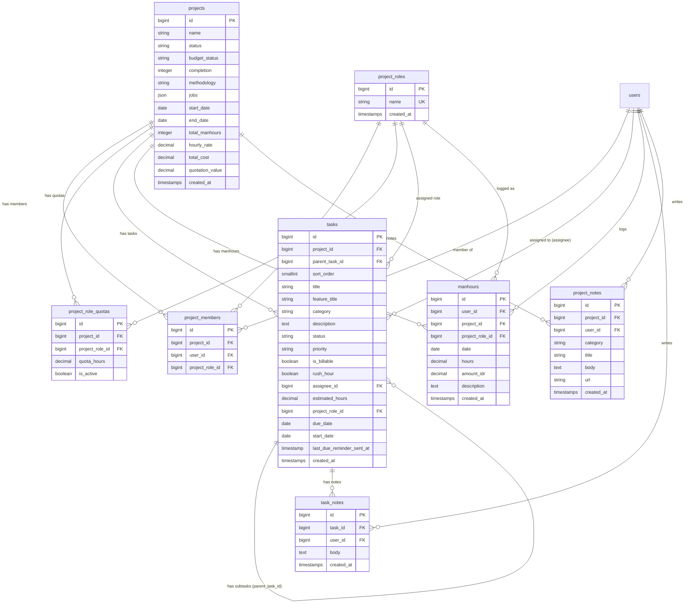

### 4.3 Domain Finance

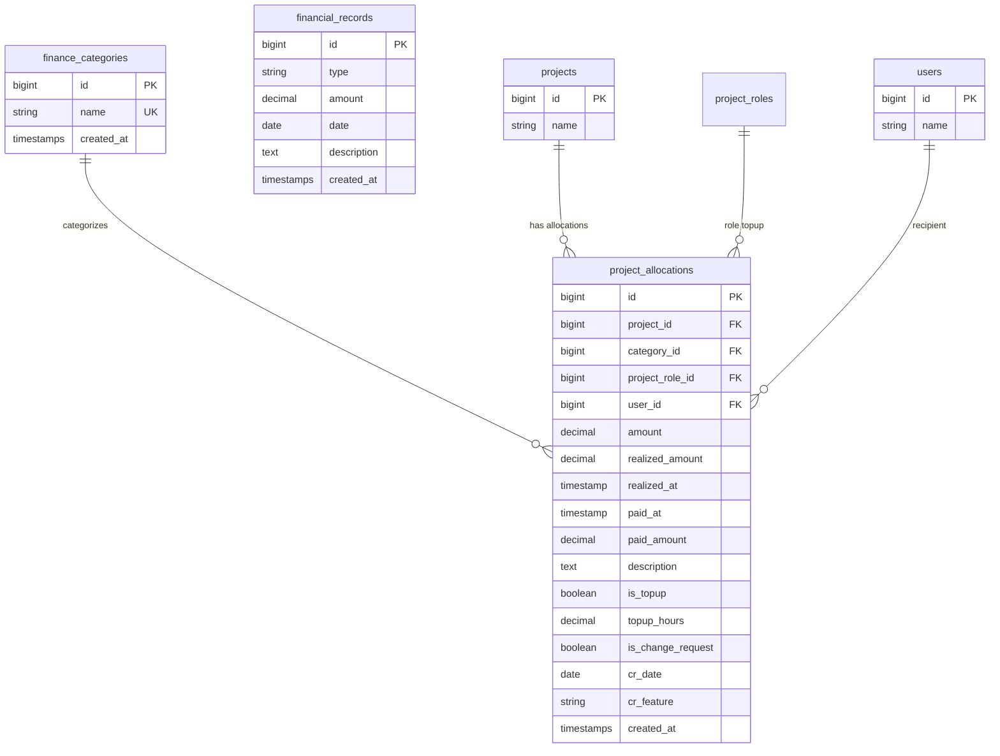

### 4.4 Domain Sales & Presales

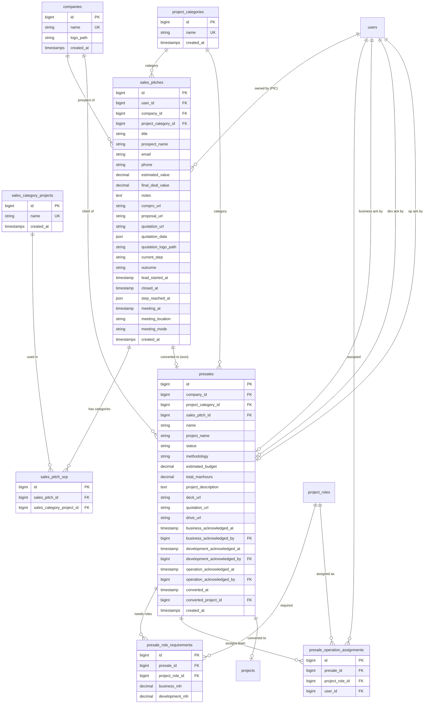

### 4.5 Domain System

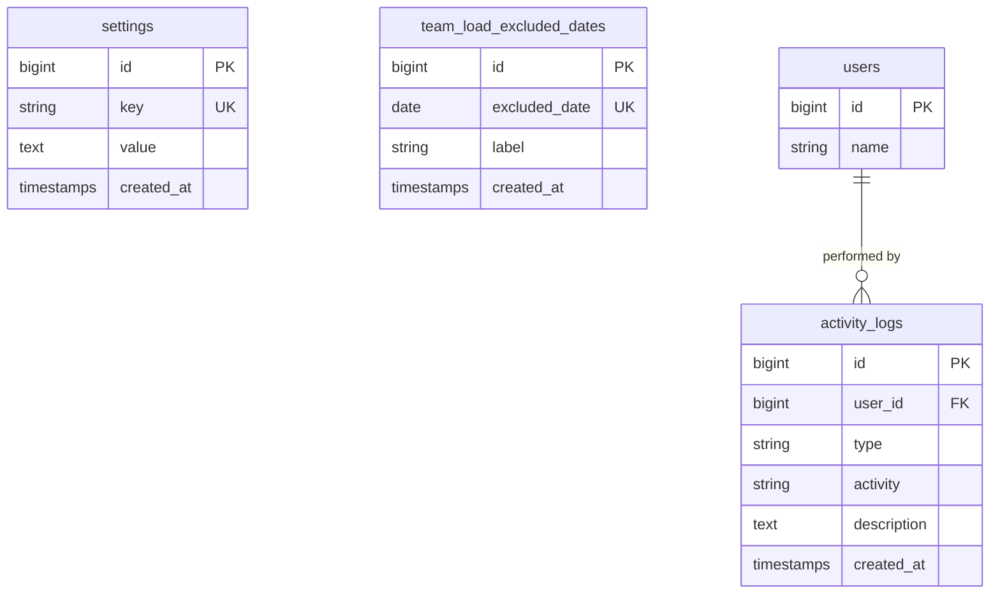

---

## 5. Skema Database Lengkap

### Tabel: `users`
| Kolom | Tipe | Keterangan |
|---|---|---|
| id | bigint PK | Auto increment |
| name | string | Nama lengkap |
| email | string UK | Unique, digunakan login |
| phone_number | string nullable | Opsional |
| status | string | `active` / `inactive` |
| task_email_notifications_enabled | boolean | Default `true` |
| timezone | string | Default `Asia/Jakarta` |
| role_id | bigint FK | → roles |
| password | string nullable | Bcrypt hashed |

### Tabel: `projects`
| Kolom | Tipe | Keterangan |
|---|---|---|
| id | bigint PK | |
| name | string | Nama project |
| status | string | `Planning` / `In Progress` / `Done` |
| budget_status | string | `On Budget` / `Over Budget` |
| completion | integer | % completion |
| methodology | string nullable | `Agile Scrum` / `Waterfall` |
| jobs | json nullable | Array job/posisi dalam project |
| start_date | date nullable | |
| end_date | date nullable | |
| total_manhours | integer nullable | Total MH yang dialokasikan |
| hourly_rate | decimal(15,2) nullable | Rate per jam (IDR) |
| total_cost | decimal(15,2) nullable | Estimasi biaya total |
| quotation_value | decimal(15,2) nullable | Nilai kontrak |

### Tabel: `tasks`
| Kolom | Tipe | Keterangan |
|---|---|---|
| id | bigint PK | |
| project_id | bigint FK | → projects (cascade delete) |
| parent_task_id | bigint FK nullable | → tasks (self-referential, subtask) |
| sort_order | smallint | Urutan drag & drop |
| title | string | Judul task |
| feature_title | string nullable | Nama fitur/modul |
| category | string nullable | Kategori bebas |
| description | text nullable | |
| status | string | `To Do` / `In Progress` / `Done` / `Reopen` |
| priority | string | `Low` / `Medium` / `High` |
| is_billable | boolean | Default `true` |
| rush_hour | boolean | Multiplier 1.3x bila `true` |
| assignee_id | bigint FK nullable | → users |
| estimated_hours | decimal(8,2) | Estimasi jam |
| project_role_id | bigint FK nullable | → project_roles |
| due_date | date nullable | |
| start_date | date nullable | |
| last_due_reminder_sent_at | timestamp nullable | Tracking pengiriman reminder |

### Tabel: `project_allocations`
| Kolom | Tipe | Keterangan |
|---|---|---|
| id | bigint PK | |
| project_id | bigint FK | → projects |
| category_id | bigint FK | → finance_categories |
| project_role_id | bigint FK nullable | → project_roles (untuk top-up) |
| user_id | bigint FK nullable | → users (penerima alokasi) |
| amount | decimal(15,2) | Nilai alokasi (IDR) |
| realized_amount | decimal(15,2) nullable | Nilai realisasi |
| realized_at | timestamp nullable | Tanggal realisasi |
| paid_at | timestamp nullable | Tanggal pembayaran |
| paid_amount | decimal(15,2) | Jumlah yang dibayar (default 0) |
| description | text nullable | Keterangan |
| is_topup | boolean | Flag top-up jam |
| topup_hours | decimal(10,2) nullable | Jumlah jam top-up |
| is_change_request | boolean | Flag change request |
| cr_date | date nullable | Tanggal CR |
| cr_feature | string nullable | Fitur yang di-CR |

### Tabel: `sales_pitches`
| Kolom | Tipe | Keterangan |
|---|---|---|
| id | bigint PK | |
| user_id | bigint FK | → users (PIC/sales) |
| company_id | bigint FK nullable | → companies |
| project_category_id | bigint FK nullable | → project_categories |
| title | string | Judul pitch |
| prospect_name | string | Nama prospect |
| email / phone | string nullable | Kontak |
| estimated_value | decimal(15,2) nullable | Estimasi nilai deal |
| final_deal_value | decimal(15,2) nullable | Nilai final saat won |
| current_step | string | Step aktif pipeline |
| outcome | string nullable | `win` / `lost` |
| lead_started_at | timestamp | Kapan lead mulai |
| closed_at | timestamp nullable | Kapan deal ditutup |
| step_reached_at | json nullable | Timestamp tiap step dicapai |
| quotation_data | json nullable | Data quotation editor |
| quotation_logo_path | string nullable | Path logo pada quotation |

### Tabel: `presales`
| Kolom | Tipe | Keterangan |
|---|---|---|
| id | bigint PK | |
| company_id | bigint FK nullable | → companies |
| project_category_id | bigint FK nullable | → project_categories |
| sales_pitch_id | bigint FK nullable UK | → sales_pitches (1:1 bila dari won deal) |
| project_name | string | Nama project yang diusulkan |
| status | string | `Lead` / `Identified` / `Proposal` / `Presentation` / `Negotiation` / `Won` / `Lost` |
| methodology | string nullable | `Agile Scrum` / `Waterfall` |
| estimated_budget | decimal(15,2) nullable | |
| total_manhours | decimal(10,2) nullable | |
| business_acknowledged_by | bigint FK nullable | → users |
| development_acknowledged_by | bigint FK nullable | → users |
| operation_acknowledged_by | bigint FK nullable | → users |
| converted_project_id | bigint FK nullable | → projects (setelah Proceed to Project) |

---

## 6. Alur Bisnis

### 6.1 Sales Pipeline (Sales Pitch)

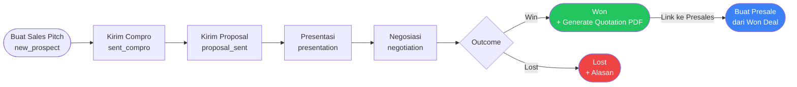

**Catatan step Sales Pitch:**

| Step | `current_step` | Yang dilakukan |
|---|---|---|
| 1 | `new_prospect` | Data awal prospect |
| 2 | `sent_compro` | Kirim company profile |
| 3 | `proposal_sent` | Kirim proposal dokumen |
| 4 | `presentation` | Meeting/presentasi (online/offline) |
| 5 | `negotiation` | Negosiasi, generate quotation |
| — | outcome: `win` | Deal menang |
| — | outcome: `lost` | Deal kalah |

---

### 6.2 Presales Pipeline → Convert ke Project

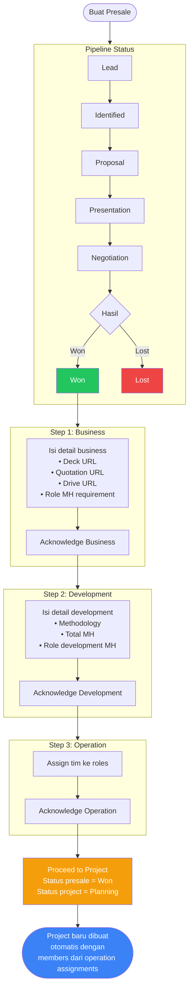

---

### 6.3 Project Lifecycle

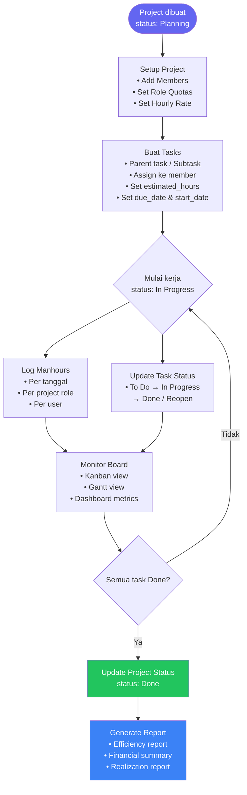

**Status task yang valid:**

| Status | Keterangan |
|---|---|
| `To Do` | Belum dikerjakan |
| `In Progress` | Sedang dikerjakan |
| `Done` | Selesai |
| `Reopen` | Dibuka kembali |

**Aturan subtask:**
- Task bisa punya banyak subtask (parent_task_id)
- Nesting maksimal **1 level** (subtask tidak bisa punya subtask)
- `estimated_hours` parent = sum estimated_hours subtask yang `is_billable = true`
- Quota Scrum dihitung dari: subtask ATAU parent yang tidak punya subtask

---

### 6.4 Finance Monitoring

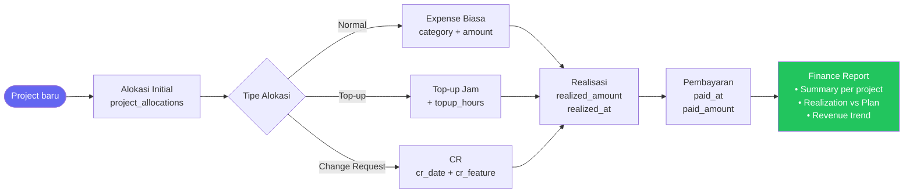

**Aksi pada project_allocations:**

| Aksi | Endpoint | Keterangan |
|---|---|---|
| Tambah alokasi | `POST /project-allocations` | Alokasi biaya normal |
| Top-up jam | `POST /projects/{id}/top-up` | Tambah jam role tertentu |
| Change Request | `POST /projects/{id}/change-request` | CR dengan fitur baru |
| Transfer quota | `POST /projects/{id}/quota-transfer` | Pindah quota antar role |
| Realisasi | `PUT /project-allocations/{id}/realization` | Tandai terealisasi |
| Tandai bayar | `PUT /project-allocations/{id}/paid` | Catat pembayaran |
| Nonaktifkan quota | `POST /projects/{id}/role-quotas/{quotaId}/deactivate` | |

---

### 6.5 Team Load

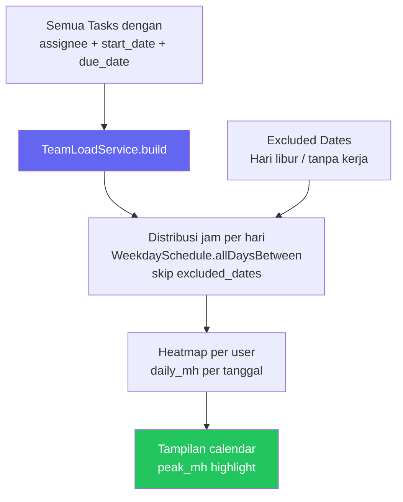

**Cara hitung:** `estimated_hours ÷ jumlah_hari_kerja_dalam_range` = jam per hari per task

---

## 7. Modul & Fitur

| Modul | URL | Deskripsi |
|---|---|---|
| **Dashboard** | `/` | Overview stats: project aktif, task summary, aktivitas terbaru |
| **Sales** | `/sales` | Pipeline sales pitch, generate quotation PDF |
| **Presales** | `/presales` | Pipeline presales, workflow business→dev→op, convert ke project |
| **List Company** | `/presales-companies` | Master data perusahaan klien |
| **Category Project** | `/presales-project-categories` | Master kategori project |
| **Sales Category** | `/sales-category-projects` | Master kategori sales |
| **List Project** | `/create-project` | Daftar semua project, buat project baru |
| **Project Board** | `/board/:projectId` | Kanban board tasks, log manhour, subtask |
| **Board Dashboard** | `/board/:projectId/dashboard` | Metrik dan ringkasan per project |
| **Gantt Chart** | `/board/:projectId/gantt` | Timeline Gantt view |
| **Team Load** | `/team-load` | Kapasitas tim berdasarkan distribusi task |
| **Finance Monitoring** | `/finance-monitoring` | Alokasi, top-up, CR, realisasi, pembayaran |
| **Finance Categories** | `/finance-categories` | Master kategori keuangan |
| **Finance Report** | `/finance-report` | Catatan OPEX/CAPEX perusahaan |
| **Realization Report** | `/finance-realization-report` | Realisasi vs plan per project |
| **Reports** | `/reports` | Efisiensi, revenue trend, financial analysis |
| **Generate Report** | `/generate-report` | Generate & kirim laporan per email |
| **Integrasi** | `/integrasi/projects` | Sinkronisasi project dari sistem eksternal |
| **Teams & Users** | `/users` | Manajemen user |
| **Access Control** | `/roles` | Manajemen role & permission |
| **Project Roles** | `/project-roles` | Master role dalam project (Developer, QA, dll) |
| **System Logs** | `/system-logs` | Audit trail aktivitas user |
| **Settings** | `/settings` | Branding (logo, favicon), SMTP, reset data |
| **Profile** | `/profile` | Profil & password user |

---

## 8. Sistem RBAC (Hak Akses)

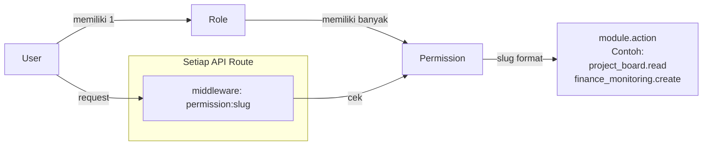

### Daftar Role Default

| Role | Deskripsi | Default Permissions |
|---|---|---|
| **Admin** | Akses penuh semua modul | Semua permissions |
| **Board Member** | Anggota tim project | `project_board.*`, `profile.*` |
| **Freelance** | Kontraktor eksternal | `project_board.read`, `project_board.update`, `profile.*` |

### Semua Permission Slug

| Modul | Slug |
|---|---|
| Dashboard | `dashboard.read` |
| Presales | `presales.{create,read,update,delete}` |
| Sales | `sales.{create,read,update,delete}` |
| List Company | `list_company.{create,read,update,delete}` |
| Category Project | `category_project.{create,read,update,delete}` |
| Sales Category Project | `sales_category_project.{create,read,update,delete}` |
| List Project | `list_project.{create,read,update,delete}` |
| Project Board | `project_board.{create,read,update}` |
| Team Load | `load.read` |
| Reports | `reports.read` |
| Generate Report | `generate_report.{create,read}` |
| Finance Monitoring | `finance_monitoring.{create,read,update,delete}` |
| Finance Categories | `finance_categories.{create,read,update,delete}` |
| Finance Report | `finance_report.{create,read,delete}` |
| Realization Report | `realization_report.read` |
| Integrasi | `integrasi.read` |
| Teams & Users | `teams_users.{create,read,update,delete}` |
| Access Control | `access_control.{create,read,update,delete}` |
| Project Roles | `project_roles.{create,read,update,delete}` |
| System Log | `system_log.{read,delete}` |
| Settings | `settings.{read,update,reset}` |
| Profile | `profile.{read,update}` |

---

## 9. API Reference

**Base URL:** `/api`  
**Auth Header:** `Authorization: Bearer {token}`  
**Format:** JSON  

### Auth

| Method | Endpoint | Permission | Keterangan |
|---|---|---|---|
| POST | `/login` | — | Login, rate limit 10/menit |
| POST | `/signup` | — | Signup jika diaktifkan, rate limit 5/menit |
| GET | `/me` | auth | Data user yang login |
| POST | `/logout` | auth | Hapus token |
| PUT | `/profile` | `profile.update` | Update profil & password |
| GET | `/branding` | — | Data branding publik (logo, nama app) |

### Projects

| Method | Endpoint | Permission | Keterangan |
|---|---|---|---|
| GET | `/projects` | `project_board.read` | Semua project |
| POST | `/projects` | `list_project.create` | Buat project baru |
| DELETE | `/projects` | `list_project.delete` | Hapus project |
| GET | `/projects/{id}/quotas` | `project_board.read` | Quota MH per role |
| GET | `/projects/{id}/balance` | `project_board.read` | Saldo jam project |
| GET | `/projects/{id}/members` | `project_board.read` | Anggota project |
| GET | `/projects/{id}/notes` | `project_board.read` | Catatan project |
| POST | `/projects/{id}/notes` | `project_board.read` | Tambah catatan |
| PUT | `/projects/{id}/notes/{noteId}` | `project_board.read` | Edit catatan |
| DELETE | `/projects/{id}/notes/{noteId}` | `project_board.read` | Hapus catatan |
| GET | `/projects/{id}/assignment-options` | `list_project.update` | Opsi assign member |
| PUT | `/projects/{id}/members` | `list_project.update` | Sync members project |
| PATCH | `/projects/{id}/status` | `project_board.update` | Update status project |
| GET | `/projects/{id}/finance-summary` | `finance_monitoring.read` | Ringkasan keuangan |

### Tasks

| Method | Endpoint | Permission | Keterangan |
|---|---|---|---|
| GET | `/tasks` | `project_board.read` | Tasks (filter by project_id) |
| POST | `/tasks` | `project_board.create` | Buat task/subtask baru |
| PUT | `/tasks/{id}` | `project_board.update` | Edit task |
| DELETE | `/tasks/{id}` | `project_board.update` | Hapus task |
| PUT | `/tasks/{id}/status` | `project_board.update` | Update status task |
| PUT | `/tasks/bulk-edit` | `project_board.update` | Bulk edit manhours |
| GET | `/tasks/template` | `project_board.read` | Download template CSV import |
| POST | `/tasks/import` | `project_board.create` | Import tasks dari CSV |
| GET | `/tasks/{taskId}/notes` | `project_board.read` | Catatan task |
| POST | `/tasks/{taskId}/notes` | `project_board.read` | Tambah catatan task |
| DELETE | `/tasks/{taskId}/notes/{noteId}` | `project_board.read` | Hapus catatan task |

### Manhours

| Method | Endpoint | Permission | Keterangan |
|---|---|---|---|
| GET | `/manhours` | `project_board.read` | Log manhour (filter project) |
| POST | `/manhours` | `project_board.create` | Tambah log manhour |

### Presales

| Method | Endpoint | Permission | Keterangan |
|---|---|---|---|
| GET | `/presales` | `presales.read` | Semua presales |
| POST | `/presales` | `presales.create` | Buat presale baru |
| PUT/PATCH | `/presales/{id}` | `presales.update` | Edit presale |
| DELETE | `/presales/{id}` | `presales.delete` | Hapus presale |
| PUT | `/presales/{id}/business` | `presales.update` | Update step business |
| POST | `/presales/{id}/business/acknowledge` | `presales.update` | Acknowledge business |
| PUT | `/presales/{id}/development` | `presales.update` | Update step development |
| POST | `/presales/{id}/development/acknowledge` | `presales.update` | Acknowledge development |
| PUT | `/presales/{id}/operation` | `presales.update` | Update step operation (assign tim) |
| POST | `/presales/{id}/operation/acknowledge` | `presales.update` | Acknowledge operation |
| POST | `/presales/{id}/proceed-project` | `presales.update` | Convert ke project |

### Sales Pitches

| Method | Endpoint | Permission | Keterangan |
|---|---|---|---|
| GET | `/sales-pitches` | `sales.read` | Semua pitch |
| GET | `/sales-pitches/{id}` | `sales.read` | Detail pitch |
| POST | `/sales-pitches` | `sales.create` | Buat pitch baru |
| PUT | `/sales-pitches/{id}` | `sales.update` | Edit pitch |
| DELETE | `/sales-pitches/{id}` | `sales.delete` | Hapus pitch |
| GET | `/sales-pitches/form-options` | `sales.read` | Opsi form (companies, categories) |
| POST | `/sales-pitches/link-won-presale/{presaleId}` | `sales.update` | Link ke presale |
| GET | `/sales-pitches/{id}/quotation/default` | `sales.read` | Default data quotation |
| POST | `/sales-pitches/{id}/quotation/preview` | `sales.update` | Preview quotation PDF |
| POST | `/sales-pitches/{id}/quotation/generate` | `sales.update` | Generate & simpan PDF |
| POST | `/sales-pitches/{id}/quotation/logo` | `sales.update` | Upload logo quotation |
| DELETE | `/sales-pitches/{id}/quotation/logo` | `sales.update` | Hapus logo quotation |

### Finance Monitoring

| Method | Endpoint | Permission | Keterangan |
|---|---|---|---|
| GET | `/project-allocations` | `finance_monitoring.read` | Semua alokasi |
| POST | `/project-allocations` | `finance_monitoring.create` | Tambah alokasi |
| PUT | `/project-allocations/{id}` | `finance_monitoring.update` | Edit alokasi |
| PUT | `/project-allocations/{id}/realization` | `finance_monitoring.update` | Realisasi alokasi |
| PUT | `/project-allocations/{id}/paid` | `finance_monitoring.update` | Tandai sudah dibayar |
| DELETE | `/project-allocations/{id}` | `finance_monitoring.delete` | Hapus alokasi |
| POST | `/projects/{id}/top-up` | `finance_monitoring.create` | Top-up jam |
| POST | `/projects/{id}/change-request` | `finance_monitoring.create` | Change request |
| POST | `/projects/{id}/quota-transfer` | `finance_monitoring.update` | Transfer quota antar role |
| POST | `/projects/{id}/role-quotas/{quotaId}/deactivate` | `finance_monitoring.update` | Nonaktifkan quota |

### Analytics & Reports

| Method | Endpoint | Permission | Keterangan |
|---|---|---|---|
| GET | `/stats` | `reports.read` | Statistik umum |
| GET | `/dashboard/overview` | `dashboard.read` | Data dashboard |
| GET | `/stats/recent` | `dashboard.read` | Log aktivitas terbaru |
| GET | `/reports/efficiency` | `reports.read` | Laporan efisiensi |
| GET | `/reports/revenue-trend` | `reports.read` | Tren revenue |
| GET | `/reports/company-projects` | `reports.read` | Project per perusahaan |
| GET | `/reports/company-financials` | `reports.read` | Keuangan per perusahaan |
| GET | `/reports/expense-payment-breakdown` | `reports.read` | Breakdown expense |
| GET | `/reports/projects` | `generate_report.read` | Data untuk generate report |
| POST | `/reports/generate` | `generate_report.create` | Generate laporan |
| POST | `/reports/send-email` | `generate_report.create` | Kirim laporan via email |
| GET | `/financial-reports/summary` | `finance_report.read` | Ringkasan keuangan |
| GET | `/financial-reports/project-realization` | `realization_report.read` | Realisasi project |
| POST | `/financial-reports/records` | `finance_report.create` | Tambah financial record |
| DELETE | `/financial-reports/records/{id}` | `finance_report.delete` | Hapus financial record |

### Master Data

| Method | Endpoint | Permission | Keterangan |
|---|---|---|---|
| GET/POST/PUT/DELETE | `/companies` | `list_company.*` | Master perusahaan |
| GET/POST/PUT/DELETE | `/project-categories` | `category_project.*` | Master kategori project |
| GET/POST/PUT/DELETE | `/sales-category-projects` | `sales_category_project.*` | Master kategori sales |
| GET/POST/PUT/DELETE | `/finance-categories` | `finance_categories.*` | Master kategori finance |
| GET/POST/PUT/DELETE | `/project-roles` | `project_roles.*` | Master role project |
| GET/POST/PUT/DELETE | `/roles` | `access_control.*` | System roles |
| GET | `/permissions` | `access_control.read` | Semua permissions |

### System

| Method | Endpoint | Permission | Keterangan |
|---|---|---|---|
| GET/POST/PUT/DELETE | `/users` | `teams_users.*` | Manajemen user |
| GET | `/team-load` | `load.read` | Data kapasitas tim |
| POST | `/team-load/excluded-dates` | `load.read` | Tambah tanggal libur |
| DELETE | `/team-load/excluded-dates/{id}` | `load.read` | Hapus tanggal libur |
| GET | `/activity-logs` | `system_log.read` | Audit log |
| POST | `/activity-logs/cleanup` | `system_log.delete` | Bersihkan log lama |
| GET | `/settings/all` | `settings.read` | Semua setting |
| POST | `/settings/update` | `settings.update` | Update setting |
| POST | `/settings/branding/logo` | `settings.update` | Upload logo app |
| DELETE | `/settings/branding/logo` | `settings.update` | Hapus logo app |
| POST | `/settings/branding/favicon` | `settings.update` | Upload favicon |
| DELETE | `/settings/branding/favicon` | `settings.update` | Hapus favicon |
| POST | `/settings/test-smtp` | `settings.update` | Test koneksi SMTP |
| POST | `/system/reset` | `settings.reset` | Reset semua data (berbahaya!) |
| GET | `/integration/projects` | `integrasi.read` | Daftar project integrasi |
| GET | `/integration/registry` | `integrasi.read` | Registry integrasi |

---

## 10. Email Notifications & Scheduled Jobs

### Email yang Dikirim Otomatis

| Event | Mail Class | Penerima | Trigger |
|---|---|---|---|
| Task di-assign | `TaskAssignedMail` | Assignee task | Saat `POST /tasks` atau `PUT /tasks/{id}` dengan perubahan assignee |
| Task hampir jatuh tempo | `TaskDueReminderMail` | Assignee task | Scheduled command harian |

**Setting per user:** User bisa menonaktifkan email via `task_email_notifications_enabled = false`

### Scheduled Commands

| Command | Jadwal | Fungsi |
|---|---|---|
| `SendTaskDueReminders` | Harian | Kirim reminder untuk task yang due dalam waktu dekat dan belum dikirim reminder |
| `CleanupLogs` | Periodik | Hapus activity log yang sudah lama |

### Setting Keys

Konfigurasi disimpan di tabel `settings` (key-value):

| Key | Keterangan |
|---|---|
| `app_name` | Nama aplikasi |
| `app_logo_path` | Path logo di storage |
| `app_favicon_path` | Path favicon |
| `smtp_host` | SMTP host |
| `smtp_port` | SMTP port |
| `smtp_username` | SMTP username |
| `smtp_password` | SMTP password |
| `smtp_from_address` | Alamat pengirim email |
| `smtp_from_name` | Nama pengirim email |
| `allow_public_signup` | `true/false` — apakah endpoint signup aktif |
| `sanctum_token_expiration_minutes` | Durasi token login (default 720) |

---

*Dokumen ini di-generate dari kode sumber pada 2026-05-30. Perbarui saat ada perubahan skema atau alur bisnis yang signifikan.*
